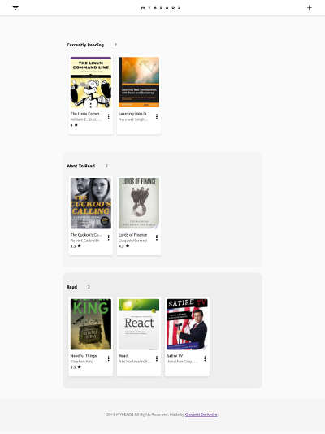

# FEND: MyReads Project

#### About


My reads app is a PWA site build with **reactjs**. The site has a user library of books. There are three lists/shelves of books: currently reading, want to read, and read. The user can move books to other lists in the app. Also user can add books to the library by searching books from an API (Udacity books API). No account needed to use app.

**Disclaimer:** *app is only a prototype and design for learning purposes.*

## Development

Web app build using [React 16]()
, to start this project from scratch if you wish! Just be sure to use [Create React App](https://github.com/facebookincubator/create-react-app) to bootstrap the project.

## TL;DR

To get started developing right away:

* install all project dependencies with `npm install`
* start the development server with `npm start`
* start the production server
    - live production lives in the `build/` folder. Run `serve -s build ` and it will give you a localhost port to use.

## Backend Server

To simplify your development process, we've provided a backend server for you to develop against. The provided file [`BooksAPI.js`](src/BooksAPI.js) contains the methods you will need to perform necessary operations on the backend:

* [`getAll`](#getall)
* [`update`](#update)
* [`search`](#search)

### `getAll`

Method Signature:

```js
getAll()
```

* Returns a Promise which resolves to a JSON object containing a collection of book objects.
* This collection represents the books currently in the bookshelves in your app.

### `update`

Method Signature:

```js
update(book, shelf)
```

* book: `<Object>` containing at minimum an `id` attribute
* shelf: `<String>` contains one of ["wantToRead", "currentlyReading", "read"]
* Returns a Promise which resolves to a JSON object containing the response data of the POST request

### `search`

Method Signature:

```js
search(query)
```

* query: `<String>`
* Returns a Promise which resolves to a JSON object containing a collection of a maximum of 20 book objects.
* These books do not know which shelf they are on. They are raw results only. You'll need to make sure that books have the correct state while on the search page.

## Important
The backend API uses a fixed set of cached search results and is limited to a particular set of search terms, which can be found in [SEARCH_TERMS.md](SEARCH_TERMS.md). That list of terms are the _only_ terms that will work with the backend, so don't be surprised if your searches for Basket Weaving or Bubble Wrap don't come back with any results.

## Create React App

This project was bootstrapped with [Create React App](https://github.com/facebookincubator/create-react-app). You can find more information on how to perform common tasks [here](https://github.com/facebookincubator/create-react-app/blob/master/packages/react-scripts/template/README.md).

## Contributing

Yes. Hit me up on GitHub.

## Feedback
[Say hi!](http://giovannilara.com)

## Licence
MIT